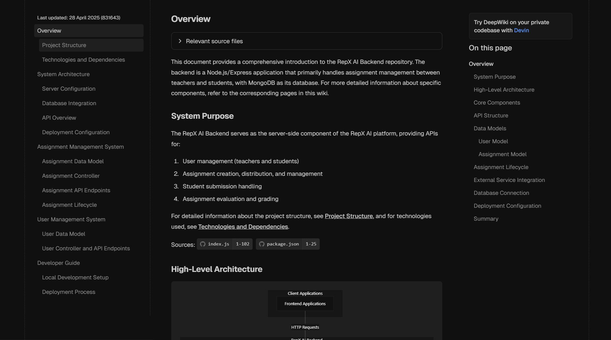

# RepX AI Backend

[](https://opensource.org/licenses/ISC)

The backend server for RepX AI, an educational platform that facilitates assignment creation, submission, and evaluation between teachers and students.

## 📚 Documentation

For detailed documentation, visit our [RepX AI Backend Documentation](https://deepwiki.com/Rep-X-AI/repx-ai-backend)



## 🚀 Features

- **User Management**: Support for teacher and student roles
- **Assignment Creation**: Teachers can create assignments with detailed instructions
- **Assignment Submission**: Students can join assignments and submit their work
- **Evaluation System**: Teachers can evaluate and grade student submissions
- **API Endpoints**: RESTful API endpoints for frontend integration

## 🛠️ Tech Stack

- **Node.js**: JavaScript runtime
- **Express**: Web framework
- **MongoDB**: Database
- **Mongoose**: MongoDB object modeling
- **Vercel**: Deployment platform

## 🔧 Installation

1. Clone the repository:

   ```bash
   git clone https://github.com/Rep-X-AI/repx-ai-backend.git
   cd repx-ai-backend
   ```

2. Install dependencies:

   ```bash
   npm install
   ```

3. Create a `.env` file in the root directory with the following variables:

   ```env
   PORT=8080
   MONGO_URI=your_mongodb_connection_string
   REACT_APP_NODE_ENV=development
   ```

4. Start the development server:

   ```bash
   npm run dev
   ```

## 📝 API Endpoints

### User Routes

- `GET /api/users/fetchuser/:useruid` - Fetch user by ID
- `POST /api/users` - Create a new user

### Assignment Routes

- `POST /api/assignments/create` - Create a new assignment
- `POST /api/assignments/joinAssignment` - Join an assignment
- `POST /api/assignments/submitAssignment/:id` - Submit an assignment
- `GET /api/assignments/teachers/:useruid` - Fetch assignments created by a teacher
- `GET /api/assignments/students/:useruid` - Fetch assignments assigned to a student
- `PATCH /api/assignments/:id` - Update an assignment
- `DELETE /api/assignments/:id` - Delete an assignment
- `GET /api/assignments/get-assignment-teacher/:id` - Get assignment details for teacher
- `GET /api/assignments/get-assignment-student/:id` - Get assignment details for student
- `GET /api/assignments/get-submissions-teacher/:id` - Get submissions for a teacher
- `GET /api/assignments/get-submissions-student/:id` - Get submission for a student
- `POST /api/assignments/evaluate/:id` - Evaluate a submission

## 🧪 Testing

```bash
# Run tests (when implemented)
npm test
```

## 📄 License

This project is licensed under the [MIT LICENSE](./LICENSE).

## 👥 Contributing

Contributions are welcome! Please check out our [Contributing Guidelines](CONTRIBUTING.md) for more details.

## Authors

- [Subhadeep Roy](git.new/Subha)
- [Satyaki Dey](https://github.com/SatyakiDey75)
- [Priyanshu Dutta
](github.com/priyanshudutta04)
- [Rishi Bhattasali
](github.com/Rishi2403)
- [Arunava Dutta
](github.com/ArunavaCoderEm)
- [Pretisha Sahoo
](https://github.com/PretishaSahoo)

---